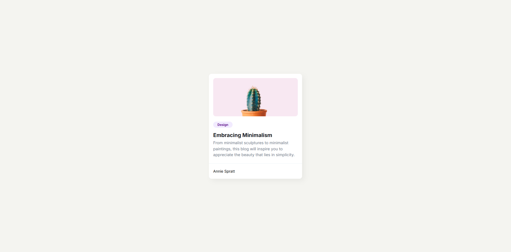

<h1 align="center">{Minimal Blog Card} | devChallenges</h1>

   Solution for a challenge <a href="https://devchallenges.io/challenge/minimal-blog-card" target="_blank">Minimal Blog Card</a> from <a href="http://devchallenges.io" target="_blank">devChallenges.io</a>.

  <h3>
    <a href="https://lzhong0119.github.io/DevChallenge_Minimal-Blog-Card/">
      Demo
    </a>
     | 
    <a href="https://github.com/lzhong0119/DevChallenge_Minimal-Blog-Card">
      Solution
    </a>
     | 
    <a href="https://devchallenges.io/challenge/minimal-blog-card">
      Challenge
    </a>
  </h3>

## Overview

My version:

- Semantic HTML5 markup
- CSS custom properties
- Flexbox

